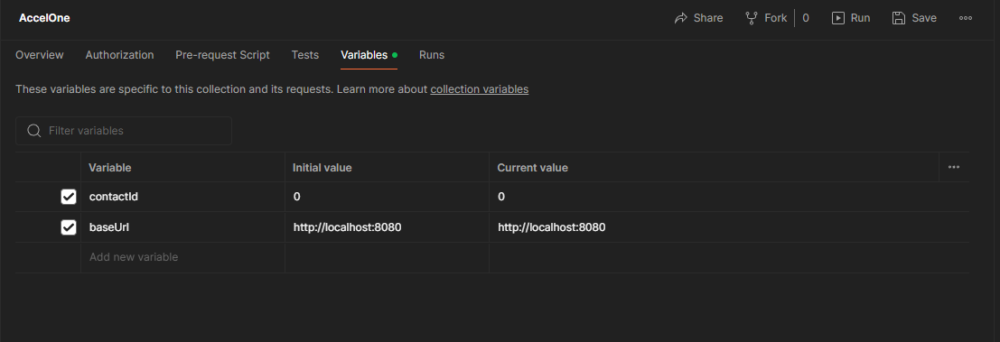
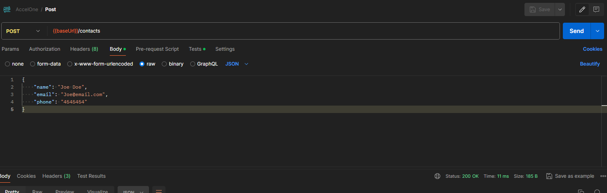
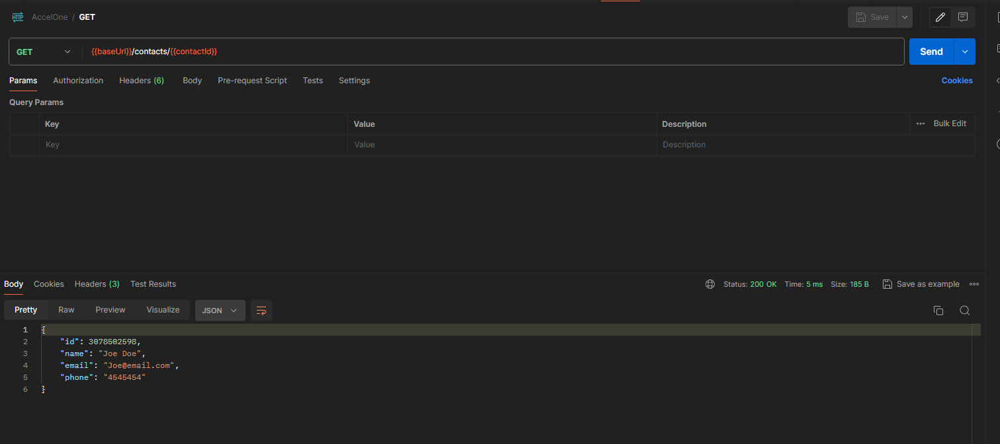
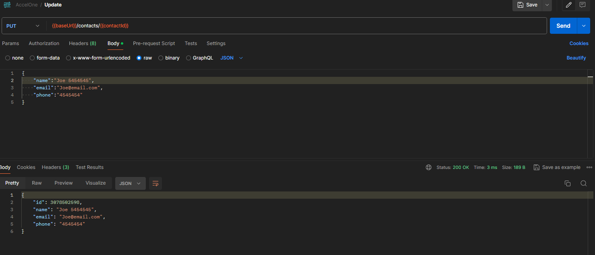
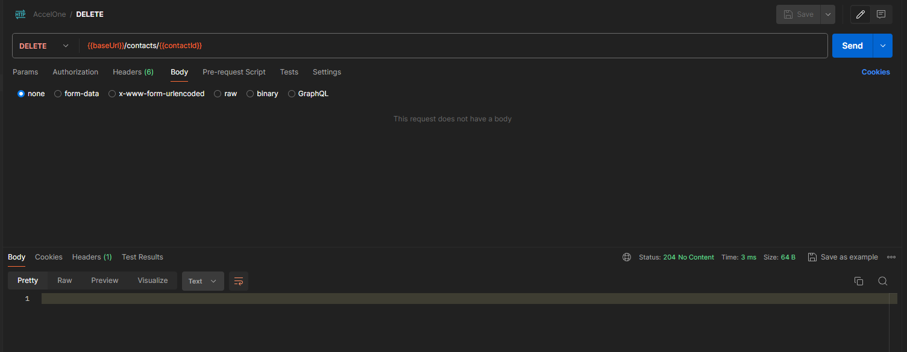

## AccelOne Challenge

Contact API

Time Aprox 1 hour and 45 minutes

## How to run

### standalone

go to folder cmd and run

```go
go run .
//or if you want a build
go build .
// depending of OS you need to set a environment
//check the oficial documentation https://go.dev/doc/tutorial/compile-install
```

### Dockerfile

```docker
docker build -t accel-one .
docker run -p 8080:8080 -d accel-one
```

### docker-compose

```
docker-compose up -d
```

## POSTMAN EXAMPLES

#### Import de collection


Collection environment:

- {{baseUrl}} = http://localhost:8080
- {{contactId}} = Id auto-generated postman got the id and set the collection environment



## Methods

### POST

Generate first a new contact


### GET

you can get the new contact with:


### Update the contact



### Delete the contact


